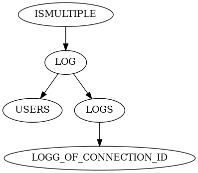

# DDL dependency graph solver for Firebird

*Disclaimer: This tool is made for a VERY spesific usecase. Most likely your problems will be solved by using `isql -x -a -o output.ddl datbase.fdb` instead of using this tool.*

Simple parser to parse (parts of the) Firebird DDL format from DBeaver to solve order of the dependency.

Context: When exporting from DBeaver it does not follow an order to allow me to import to another database. This code is just a simple parser to resolve that dependency order.

Example graph from `./src/examples/DependencyGraph.sql`

## TODO (??)
- [X] Complete the necessary parts of the parser
  - [X] Will use reference counting for procedures
        - This is not a true parser, it's just to handle the order.
- [X] Put the tables in a graph, and make it possible to get the DDL for connected nodes.
- [X] Output the code in correct order based on the graph
- ̃~~Make the parser output the full objects (i.e that they can be used to reconstruct the tables)~~
  - Dropped, don't need the full object for my use case.
